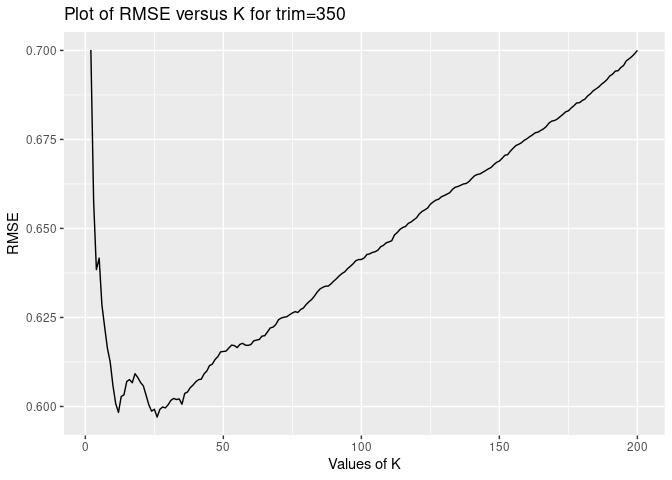

First, we will convert the data into numeric form by doing label
encodng.

Next, we split the data into training and test data. The training data
comprises of 80% of overall data, and test data comprises of remaining
40% of the data.

Next, we standardize the data to account for large differences.

Now we start with creating the models.To evaluate the models, we compare
the out-of-sample mean-squared error.  
We will first check the performance of the “medium” model that we
considered in class.

    ## [1] "The out-of-sample Root Mean-Squared Error of the medium model that we considered in class is: 0.688741751724005"

*Best Linear Model*  
We create the best linear model by removing the features fireplaces,
pctCollege, fuel, sewer, waterfront, centralAir, and landValue. We also
create a new feature given by diving bathrooms/rooms; that measures the
proportion of bathrooms available per room for the house. Finally since
the landValue of the house is a big factor in determing the price, so we
scale all these features by landValue.

    ## [1] "The out-of-sample Root Mean-Squared Error of the best linear model is: 0.622106023848185"

We can see that the out-of-sample Root Mean-Squared Error of the best
linear model is lower than the the medium model that we considered in
class. Thus it outperforms the medium model that we considered in
class.  
*The best K-nearest-neighbor regression model*  
We form the K-nearest-neighbor regression model by including the same
features as out best linear model, except that the model that we now use
is KNN regression model.  

    ## [1] "The optimal value of K is: 26"

    ## [1] "The Root Mean Squared Error of the best K-nearest-neighbor regression model for the optimal value of K on test set is: 0.597011915861631"

We can see that the out-of-sample Root Mean-Squared Error of the best
K-nearest-neighbor regression model is lower than the best linear model.
Thus it outperforms the best linear model.
